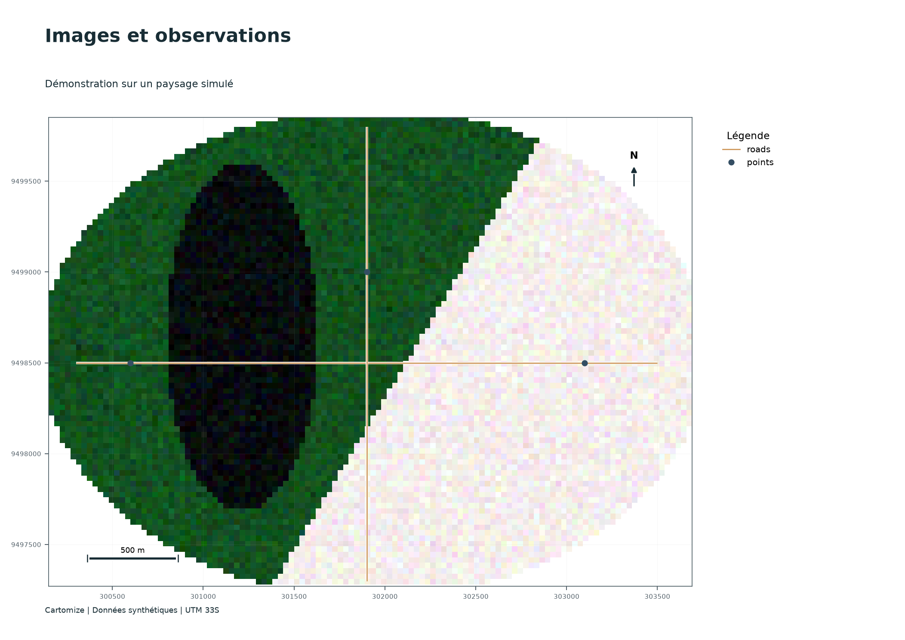

# Cartomize : projets pratiques

**Version 1.0**

Préparer des images, analyser des couches et produire des cartes reproductibles avec Cartomize. Le parcours associe des explications, du code exécutable, des résultats enregistrés et des exercices corrigés.

[Commencer par la première carte](notebooks/00_premiere_carte.ipynb) · [Voir les cas réels](#cas-réels) · [Couverture des outils](COVERAGE.md) · [Interface graphique](DESKTOP_AND_EXTENSIONS.md)



*Mosaïque, composition et superposition produites à partir du paysage pédagogique simulé.*

## Pourquoi utiliser Cartomize ?

Cartomize complète GeoPandas, Rasterio et Matplotlib en reliant la préparation des données à la production cartographique. Il conserve les objets vectoriels compatibles avec GeoPandas et produit des GeoTIFF, GeoPackage, tableaux, cartes et manifestes réutilisables.

| Besoin | Apport étudié dans le cours | Résultat |
|---|---|---|
| Préparer plusieurs scènes | Correspondances des bandes, grille commune, mosaïque, extraction et composition dans une même procédure | Multibande scientifique, bandes séparées, RVB et manifeste |
| Répéter une analyse | Plan explicite avec dépendances entre étapes | Produits intermédiaires et journal de traitement |
| Produire des cartes cohérentes | Nomenclature, cadres, légendes et maquettes réutilisables | PDF, PNG et SVG |
| Décliner les livrables | Atlas, recettes et variables de lot | Une série de cartes sans reconfigurer chaque page |
| Conserver le projet | Sessions, archives portables et empreintes | Projet réouvrable et révision traçable |

L’automatisation exécute les choix méthodologiques explicités par l’utilisateur. La définition des classes, la qualité des références et l’interprétation scientifique restent des décisions de l’étude.

## Lire ou exécuter

**Lire sur GitHub.** Ouvrir un notebook pour consulter le texte, le code et les sorties enregistrées. L’affichage GitHub est statique.

**Exécuter dans Jupyter.** Télécharger le dépôt avec **Code → Download ZIP**, extraire l’archive et ouvrir un terminal dans son dossier. Avec Python 3.11 ou 3.12 :

```bash
python -m pip install -r tutorials/requirements.txt
python -m jupyterlab tutorials/notebooks
```

Dans chaque notebook, utiliser **Run → Run All Cells**. Les fichiers sont écrits dans un nouveau sous-dossier de `tutorials/outputs/`. Les durées indiquées dans le parcours sont des durées pédagogiques estimées, pas des temps de calcul garantis.

**Anaconda sous Windows.** Depuis Anaconda Prompt, dans le dossier du dépôt :

```bat
conda create -n cartomize-cours python=3.12 pip -y
conda run -n cartomize-cours python -m pip install -r tutorials/requirements.txt
conda run -n cartomize-cours --no-capture-output python -m jupyterlab tutorials/notebooks
```

L’interface de bureau est facultative pour ce parcours. Les calculs et cartes fonctionnent sans QGIS ni ArcGIS Pro.

**Environnement distant.** La configuration Binder fournie installe les dépendances pour les exercices synthétiques. Le premier démarrage dépend du service et de sa construction d’environnement. La disponibilité d’une session Binder n’est pas garantie par les contrôles GitHub Actions.

[Ouvrir avec Binder](https://mybinder.org/v2/gh/cedrick14/cartomize-python/main?urlpath=lab/tree/tutorials/notebooks/00_premiere_carte.ipynb)

## Parcours

| Cours | Projet | Durée indicative | Livrables |
|---|---|---:|---|
| [00](notebooks/00_premiere_carte.ipynb) | Des bandes à la première carte | 15 min | Multibande, carte et manifeste |
| [01](notebooks/01_superposition_vectorielle.ipynb) | Superposition et proximité | 35 min | Intersections, mesures et carte |
| [02](notebooks/02_pretraitement_multispectral.ipynb) | Prétraitement multispectral | 30 min | Mosaïque, masques, RVB et bandes séparées |
| [03](notebooks/03_indices_algebre.ipynb) | Indices et algèbre raster | 35 min | 18 indices, filtre et statistiques |
| [04](notebooks/04_classification.ipynb) | Classification et validation | 40 min | Groupes, classes, confiance et modèles |
| [05](notebooks/05_surfaces_changements.ipynb) | Surfaces et transitions | 30 min | Bilan, matrice et carte de changement simulé |
| [06](notebooks/06_terrain_reseaux.ipynb) | Terrain, drainage et itinéraires | 30 min | Dérivées du MNT, D8 et parcours |
| [07](notebooks/07_mise_en_page_atlas.ipynb) | Mise en page et atlas | 35 min | Planche, graphique et pages par secteur |
| [08](notebooks/08_automatisation.ipynb) | Plans, recettes et lots | 40 min | Chaîne, recette et série de cartes |
| [09](notebooks/09_projets_controle.ipynb) | NoData et projets portables | 30 min | Copies masquées, CMZ et révision |
| [10](notebooks/10_catalogues_execution.ipynb) | STAC et paramètres d’exécution | 30 min | Téléchargement local vérifié et comparaison numérique |
| [11](notebooks/11_mvouti_concessions.ipynb) | Mvouti et concessions | 50 min | Carte réelle, atlas et groupes exploratoires |
| [12](notebooks/12_okapis_raster_classe.ipynb) | Raster classé de la réserve à okapis | 35 min | Audit des codes, superficies et carte |

Pour découvrir la valeur de l’automatisation : **00 → 02 → 07 → 08**. Pour une formation complète : suivre l’ordre du tableau. Chaque notebook recrée ses entrées pédagogiques et peut être exécuté indépendamment.

## Cas réels

Les cours 11 et 12 utilisent les cinq jeux de données contenus dans `Tuto.zip`. Le fichier source n’est pas redistribué dans le dépôt. Les cours 00 à 10 génèrent leurs propres données et n’exigent aucun téléchargement géographique.

Pour les personnes disposant de l’archive :

```bash
python tutorials/scripts/import_tuto.py "chemin/vers/Tuto.zip"
```

Les noms d’origine, fichiers de projection et métadonnées sont conservés. Les données restent dans `tutorials/data/private/`, exclu du dépôt. Voir [l’inventaire et les conditions de diffusion](DATA.md).

Les cartes des cas réels sont générées localement après importation des données.

## Exécution et maintenance

```bash
python tutorials/scripts/execute.py
python tutorials/scripts/execute.py --include-tuto
python tutorials/scripts/build_site.py
```

La première commande exécute les exercices autonomes dans des noyaux Jupyter séparés. La seconde ajoute les cas locaux. Les pages HTML sont générées dans `tutorials/site/` ; ouvrir `index.html` pour une lecture hors ligne. Les contrôles numériques sont dans les notebooks : conservation des codes, grilles, masques, égalité des calculs et bilan des transitions.

Le [workflow Tutoriels](https://github.com/cedrick14/cartomize-python/actions/workflows/tutorials.yml) exécute le parcours autonome et conserve son rapport en artefact téléchargeable. Voir [VALIDATION.md](VALIDATION.md) pour la portée des vérifications.

## Contribuer

Proposer un cas d’étude reproductible dans le [suivi du dépôt](https://github.com/cedrick14/cartomize-python/issues), avec l’objectif, les données diffusables, les étapes et le résultat attendu. Les contributions peuvent porter sur les corrections, les traductions, les exercices, les références ou les essais sur d’autres jeux de données. Une donnée de terrain ou une légende documentée est particulièrement utile pour transformer un exercice exploratoire en étude validée.

Cours et code : ONDON NKOUA Cédrick Belmich / Cartomize. Les scripts suivent la licence GPL-3.0-only du dépôt. Les données externes conservent leurs conditions propres. Les résultats synthétiques sont identifiés comme tels.
